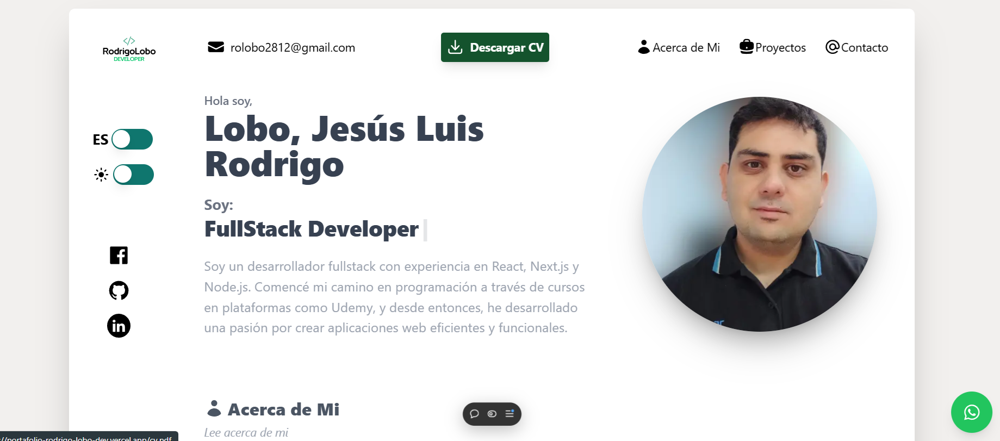

<!-- Banner -->


# 👋 ¡Hola gracias por visitar mi Proyecto!

## 🌐 Portafolio Personal: Proyectos y Experiencia en Desarrollo Web

Este es mi sitio web personal, un espacio en el que comparto mi experiencia, información de contacto, enlaces a mis redes sociales y, sobre todo, una colección de los proyectos más destacados que he desarrollado. Aquí podrás encontrar aplicaciones como 🎸 APP GUITARLA - E-commerce de Guitarras, y muchos otros proyectos que demuestran mis habilidades en frontend y backend.
Explora mis proyectos y conoce más sobre mi enfoque en la creación de soluciones prácticas y funcionales en desarrollo web.

## 🛠️ Tecnologías Utilizadas

- **Next.js**: Framework de React que permite un renderizado rápido y optimizado, ideal para SEO y carga de contenido dinámica.
- **Tailwind CSS**: Framework de CSS para crear interfaces personalizadas y responsivas de forma eficiente.
- **Headless UI (React)**: Componentes accesibles y completamente estilizados que se integran con Tailwind CSS.
- **Heroicons (React)**: Conjunto de íconos SVG adaptables y de alta calidad.
- **i18next**: Herramienta de internacionalización para manejar múltiples idiomas en el sitio.
- **React Modal**: Librería para crear modales que mejoran la experiencia de usuario.
- **React Simple Typewriter**: Componente para efectos de escritura animados en los textos, aportando dinamismo a la interfaz.
- **Swiper**: Librería para implementar sliders y carruseles responsivos y personalizables.

## 🎥 Prueba la Aplicación

Puedes probar la aplicación en vivo visitando [este enlace en Vercel](https://portafolio-rodrigo-lobo-dev.vercel.app/).

## 📝 Funcionalidades Principales

- **Información Personal y Redes Sociales**: Sección dedicada a compartir información personal relevante y enlaces directos a redes sociales y otras plataformas.
- **Enlaces a Proyectos**:  Muestra de los proyectos desarrollados, cada uno con enlaces detallados que llevan a sus respectivas descripciones y demos.
- **Galería Interactiva de Proyectos***: Los proyectos están presentados en un carrusel dinámico que permite navegar fácilmente a través de ellos.
- **Soporte Multilenguaje**: Implementación de soporte para varios idiomas, haciendo el contenido accesible a un público más amplio.
- **Efectos Visuales**: Animaciones en textos e íconos que mejoran la experiencia de usuario y la interactividad.
- **Accesibilidad a Correo Electrónico**: Enlace directo a tu correo electrónico para que los visitantes puedan contactarte de forma sencilla y rápida.
- **Descarga de CV**: Botón dedicado para la descarga de tu CV en formato PDF, facilitando el acceso directo a tus experiencias y habilidades profesionales.
- **Contacto a través de WhatsApp**: Botón flotante que permite a los visitantes contactarte directamente vía WhatsApp.

## 📂 Estructura del Proyecto

```bash
/
├── components/       # Componentes reutilizables para diferentes secciones de la aplicación.
├── context/          # Configuración de contexto para manejar estados y lógica global.
├── data/             # Datos de muestra o fijos utilizados en la aplicación.
├── helpers/          # Funciones utilitarias y de apoyo.
├── hook/             # Hooks personalizados y configuración de Axios para conexión a la API.
├── layouts/          # Estructuras de diseño y organización de la página.
├── page/             # Páginas de la aplicación y su contenido principal.
├── styles/           # Estilos globales y personalizados de Tailwind CSS.
└── translations/     # Archivos de traducción y localización para soporte multilenguaje.
```
## 🚀 Cómo Empezar
1. Clona el repositorio:

```bash
git clone https://github.com/RodrigoLoboDev/RodrigoDev
```
2. Instala las dependencias:

```bash
npm install
```

3. Inicia el servidor de desarrollo:

```bash
npm run dev
```
## 🤝 Contribuciones
Las contribuciones son bienvenidas. Si tienes ideas para mejorar el proyecto, no dudes en abrir un issue o hacer un pull request.

## 📧 Contacto
- Email: rolobo2812@gmail.com
- LinkedIn: [Jesús Luis Rodrigo Lobo](https://www.linkedin.com/in/jes%C3%BAs-luis-rodrigo-lobo-6594a81b4/)
- GitHub: [RodrigoLoboDev](https://github.com/RodrigoLoboDev)

#### ⭐️ Si te gusta lo que hago, no dudes en seguirme y contribuir a mis proyectos. ⭐️